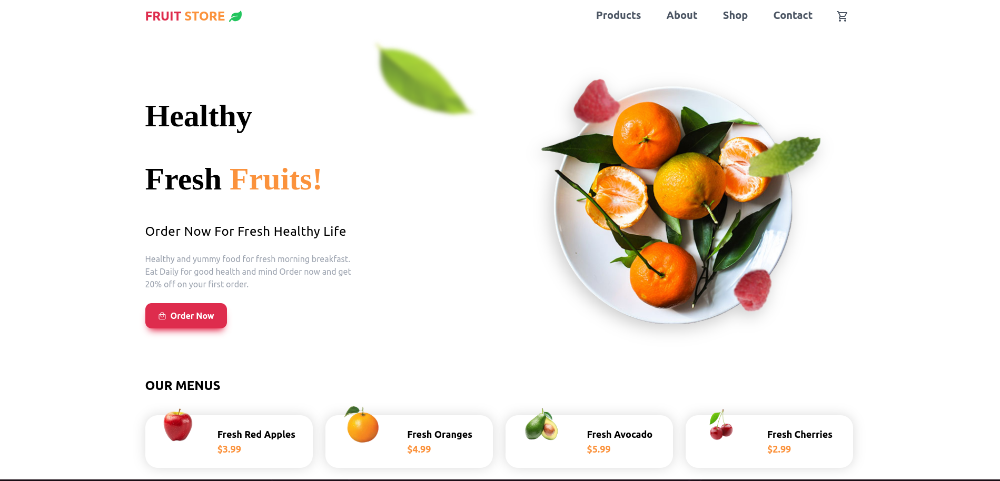

# 🍏 FruitStore - Fresh Fruits Online

Welcome to **FruitStore**, a modern, responsive, and visually appealing landing page built with **React & Vite**. Experience a sleek design with fast performance, perfect for showcasing fresh fruits online. 🍉🍇🍊

## 🚀 Live Demo
🔗 https://fruitstoreonline.netlify.app 

## 📸 Preview


---

## 🛠 Built With
- ⚡ **React + Vite** - For lightning-fast performance
- 🎨 **Tailwind CSS** - For a sleek and responsive design
- 🖼 **Framer Motion** - For smooth animations *(if used)*
- 🔥 **React Icons** - For aesthetic icons *(if used)*

---

## 📥 Installation & Setup
To run this project locally, follow these steps:

```sh
# Clone the repository
git clone https://github.com/KashifSaeed1/Fruitstore-landing-page.git

# Navigate to project folder
cd fruitstore

# Install dependencies
npm install

# Start the development server
npm run dev
```

Now, open [http://localhost:5173](http://localhost:5173) in your browser to view the project.

---

## 🎯 Features
✅ Fully responsive & mobile-friendly 📱<br>
✅ Elegant UI with modern design ✨<br>
✅ Fast & optimized performance 🚀<br>
✅ Easy customization 🛠<br>
✅ SEO-friendly 🏆<br>


## 📂 Project Structure
```
fruitstore/
├── public/          # Static assets
├── src/             # Source code
│   ├── components/  # Reusable components
│   ├── pages/       # Main pages
│   ├── assets/      # Images & icons
│   ├── App.jsx      # Root component
│   ├── main.jsx     # Entry point
├── package.json     # Dependencies & scripts
├── tailwind.config.js  # Tailwind CSS config
└── vite.config.js   # Vite configuration
```

---

## 📬 Connect with Me
👤 **Kashif Saeed**  
🔗 [Portfolio](https://kashifsaeed.netlify.app)   **https://kashifsaeed.netlify.app**
💼 [LinkedIn](https://www.linkedin.com/in/kashif-saeed-286711246/) **LinkedIn Rrofile**  
📧 Email: **kashifsaeedman@gmail.com**

---

## ⭐ Show Your Support
If you like this project, please consider **starring ⭐ the repository** on GitHub. Your support helps me continue building awesome projects! 🚀

Happy Coding! 😊
